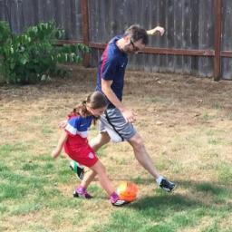

## Repository Overview

This repository hosts the code relevant to the L2D method from the paper, "Learning to Double-Check Model Prediction From a Causal Perspective."

### Major Python Package Requirements
- torch: 1.12.1
- torchvision: 0.13.1
- torchaudio: 0.12.1
- numpy: 1.21.0

models: ResNet-18, ResNet-50, and [CGN](https://github.com/autonomousvision/counterfactual_generative_networks)
### Introduction

This project tackles two crucial issues in the Out-of-Domain (OOD) generalization problem in image classification tasks, which are still highly relevant to the ongoing research on vision models (and Large Language Models):

1. What makes OOD generalization challenging for current Domain Generalization (DG) methods?
2. How can we effectively quantify the uncertainty in a model's predictions, and when should we trust these predictions?

Given that the original NICO dataset is not available online currently, we use the latest [NICO++](https://github.com/xxgege/NICO-plus) dataset. This dataset includes more diverse and challenging samples with higher quality, allowing us to thoroughly explore the real DG effects across different methods. Additionally, we have integrated extra experiments to ensure the repository remains valuable through 2024. NICO++ contains approximately one hundred classes. We have selected a subset to approximate the datasets used in the L2D paper. *You can resort to utils/dataset_constucting.py and utils/dataset_class.py for the details*. Our selection and dataset splitting were guided by two principles:

- **Challenge and Diversity:** We chose 17 different classes from NICO++ (expanding the range of both animals and vehicles), ensuring that each class has at least one similar counterpart in terms of context, shape, or background. A robust and generalizable model must learn the causal relationship between foreground features and class labels to handle OOD test cases effectively.
- **Apparent Distribution Shift:** We selected training and validation sets from three backgrounds—autumn, dim, and grass. The test sets were chosen from three different backgrounds: outdoor, rock, and water. The test set is large and contains 14564 samples, which ensures that our results are validated on a dataset representative enough.

### Comparison Between Different Methods
As far as we know, Empirical Risk Minimization (ERM), Representation Self-Challening ([RSC](https://arxiv.org/abs/2007.02454)), and Deep Ensemble ([DE](https://arxiv.org/pdf/1612.01474)), Epistemic Neural Network ([ENN](https://arxiv.org/pdf/2107.08924)) are four most classic methods in DG and uncertainty quantification fields, where RSC remains the most competitive methods in generalization tasks, and DE and ENN are state-of-the-art methods in measuring the (joint) predictive uncertainty. *We use ResNet-18 and ResNet-50 for our experiments, where you can resort to utils/resnet.py to see how to download the weights locally*.


### OOD performance.
implement the following command in the terminal to run ERM for ResNet-18, and change the parameters for other methods with different hyperparameters. We observe that SGD + Momentum better suits this image classification task compared with Adam optimizer (around 4% higher in test accuracy), hence we use it throughout the experiments.
```
python train_classifier.py --method normal --d 18 --ep 20 --bs 64 --seed 0
``` 
The train/val/test performance of resnet-18 and resnet-50 for ERM, RSC and DE are as follows:

|   Method    | Resnet-18 | |  | ResNet-50 | | |
|-------|-------|-------|-------|-------|-------|-------|
|     | train | val | test |train | val | test |
| ERM |   98.49%  |  87.32%  |    **74.27%**  |  98..54%  |   90.58%   | **82.15%**   |  
| RSC |   99.09%  |  87.86%  |   73.94%   |  99.24%  |   91.25%   |  81.34%  |  
| DE |   99.01%  |  85.90%   |   69.50%  |  99.51%  |  89.56%    |  76.90%  |  

We implemented several recent Domain Generalization (DG) methods before 2024, including those utilizing data augmentation, Invariant Risk Minimization (IRM, refer to [IRM-risk](https://openreview.net/forum?id=BbNIbVPJ-42) for better understanding), disentangling and causal techniques (e.g., [IRMcon-IPW](https://arxiv.org/pdf/2208.03462)). However, we found that none of these methods effectively improved generalization ability for the NICO++ challenge in our project (*i.e.,* at least 2% average improvement) compared to Empirical Risk Minimization (ERM). We analysis the reason from a fundamental conceptual level. The elementary concept behind these methods is to train a classifier that learns features invariant to background changes, assuming that the unbalanced distribution of background information among different classes and between train and test datasets primarily leads the model to learn spurious correlations and impairs generalization ability.

Upon examining the NICO dataset (and now the NICO++ subset), we discovered that this assumption oversimplifies the DG problem. In most NICO++ cases, the real challenge lies in the distribution shift of foreground texture and shape. For instance, while the classifier may have seen dogs from various angles in the training set, it may rarely encounter dogs wearing clothes or hats, or a new breed with unique facial features. In such scenarios, the classifier struggles to determine what to focus on: the novel attire, the unusual mouth, or the background? To some extent, when familiar foreground textures or shapes are absent from the image, the classifier begins to rely on background information, local foregound information (usually appears for multiple classes, hence noncausal) and spurious correlations learned during training for prediction. *Further, we assumed previous work like IRM really captures the key factor in OOD generalization which asserts to be the non-invariant environment/background features between train and test sets. Then by breaking such fragile correlation between non-invariant features and labels by creating counterfactual samples (background unchanged, minimal changes to the foreground which causes the label variation, refer to [CounterAL](https://aclanthology.org/2023.acl-long.636/)) can solves this problem. Because the classifier cannot rely on shortcuts and must instead focus on invariant causal features to effectively fit the training set. However, empirical evidence suggests that this assumption is far from reality.*

This distribution shift in foreground features can be somewhat challenging for humans but is generally quickly adapted to with the assistance of language/mathematical definitions. However, it poses significant difficulties for Neural Network models. This is intriguing, as it reflects the incomplete definition of classes within the dataset. In the current DG paradigm, humans create datasets based on our specialized language and recognition systems. The complex reasons why an individual animal belongs to the dog species are maximally simplified for the classifier: the common feature patterns appearing in all data labeled as "dog" define what a dog is. This approach works for IID (Independent and Identically Distributed) cases but is incomplete and flawed in OOD (Out-of-Distribution) scenarios. For example, how can the classifier distinguish between Homo sapiens and Homo neanderthalensis when both wearing clothes?

Some OOD samples are challenging because they touch upon the vague boundaries of how a class is potentially defined by the samples in NICO. This highlights the limitations of current classification approaches in handling complex, real-world variations in object appearances and contexts. However, simpling enlarging the models from ResNet-18 to ResNet-50 achieves significant improvement, which shows the power of scaling law and hint that model capacity, rather than an imperfect training set, is the primary factor limiting generalization performance at present. At this moment, a subsequent questions appears as whether pure (large) vision models can finally achieve 100% reliablity and accuracy in real world applications in the future (*i.e.,* solves the DG problem totally)? If so, what would be the architecture that leads to it?

### Uncertainty Qunatification
First, generate shape for the validation and test sets and the texture template, run with the following command, and the templates are stored in ./datas/counter/mask and ./datas/counter/foreground. 
```
python generate_template.py --mechanism shape --data 0
python generate_template.py --mechanism shape --data 1
python generate_template.py --mechanism texture 
```

Next, generate triplets with the shape and texture templates, run the following command, and the counterfactual images are stored in ./datas/counter/traid/,
```
python generate_tripletset.py --task train --mode val
python generate_tripletset.py --task train --mode test
python generate_tripletset.py --task test --mode1 test
```

Then, we can train a siamese network with the above triplets, which can strengthen the network's ability to distinguish the core features between different classes, but this contrastive training will sacrifice its classification ability to some extent. Also, Adam is chosen for optimizing the triplet loss (SGD fails to optimize this loss function). We default the model as ResNet-18, and run with the following command:
```
python train_siamese.py --d 18
```

then, run ```CL_test.py --d 18``` to get the result of how contrastive faithfulness indicates the uncertainty in each prediction made by the classification model for each image. we observe that the accuracy of the unfaithful predictions in each bin (split according to the interval that the top-1 p falls  in) is consistently significantly lower than the faithful predictions. 
For instance, we have the following result for ResNet-18, and the overall result is stored in record.py
|   top-1 pred p    | '>0.99' | '>0.95'| '>0.9'| '0.9~0.8'| '0.8~0.7'| '0.7~0.6'|'0.6~0.5'| '<0.5' | 
|-------|-------|-------|-------|-------|-------|-------|-------|-------|
| total |   0.975| 0.888| 0.77| 0.71| 0.61| 0.53|0.44| 0.32| 
| faithful |   0.986| 0.928|0.850| 0.821| 0.731| 0.606| 0.529| 0.427|
| unfaithful |    0.953| 0.849| 0.721| 0.665| 0.569| 0.511| 0.42| 0.30|

The gap between faithful and unfaithful prediction accuracy is even larger for ResNet-18 trained with Adam optimizer. 

For the original NICO animal dataset, we have the following result:
|   top-1 pred p    | '>0.99' | '>0.95'| '>0.9'| '0.9~0.8'| '0.8~0.7'| '0.7~0.6'|'0.6~0.5'| '<0.5' | 
|-------|-------|-------|-------|-------|-------|-------|-------|-------|
| total |   0.960| 0.734|0.611|0.577|0.467|0.476|0.433|0.310| 
| faithful |   0.970|0.831|0.735|0.711|0.786|0.703|0.660|0.461|
| unfaithful | 0.812|0.532|0.381|0.409|0.263|0.344|0.297|0.256 |

For the current NICO++ dataset, we have the following result:
|   top-1 pred p    | '>0.99' | '>0.95'| '>0.9'| '0.9~0.8'| '0.8~0.7'| '0.7~0.6'|'0.6~0.5'| '<0.5' | 
|-------|-------|-------|-------|-------|-------|-------|-------|-------|
| total | 0.909 | 0.686 | 0.573 | 0.479 | 0.455 | 0.421 | 0.322 | 0.229 |
| faithful |  0.942 |  0.758 | 0.631 | 0.624 | 0.531 | 0.548 | 0.442 | 0.356 |
| unfaithful | 0.828 | 0.625 | 0.530 | 0.397 | 0.424 | 0.373 | 0.279 | 0.202 |

The contrastive faithfulness analysis reveals that even predictions with high probabilities still exhibit significant uncertainty, with accuracy falling below 70% for the [0.9, 0.95] probability interval. In the NICO and NICO++ datasets, this uncertainty primarily stems from the presence of human backgrounds in both training and test images. For example, most images of footballs, bicycles, and motorcycles include humans. Consequently, models must learn that an image labeled "football" typically features balls near human legs or humans on a playing field. This requires the model to recognize subtle relationships between specific classes and the contexts in which they typically appear (see the following cases). Such a task extends beyond conventional invariant representation and feature extraction, as it demands semantic understanding of all background elements.



- P(football) = 0.39, P(dog) = 0.59
- Similarity(X,X_{football}) = 0.66, Similarity(X,X_{dog}) = 0.41

The model mistakenly identifies a dog in this image, likely due to the blurred orange ball resembling a crouching dog interacting with a human. However, counterfactual analysis reveals that the object's texture is more consistent with a ball than a dog, providing valuable feedback to correct the initial misinterpretation.


In this project, we utilized CGN solely for shape and texture generation, which has limitations in reliability. Even with these constraints, the simple ResNet model still identifies cues for its inaccurate predictions, failing the contrastive faithfulness test for both confident and less confident predictions. We believe that integrating modern segmentation and texture generation vision models could yield a more reliable system capable of double-checking predictions with high fidelity. 

Such a system should be capable of processing larger input images (at least 512x512 pixels) to preserve most of the texture information. High-quality, clear textures and their counterfactual alternatives are crucial for effective counterfactual reasoning, and the standard 224x224 pixel resolution is inadequate for this purpose. The system should first locate and separate foreground features, then generate counterfactual images for possible classes, and determine the correctness of the original prediction. This approach could help modify biased predictions or report when objects are too small for accurate identification, hence any prediction is not trustworthy.